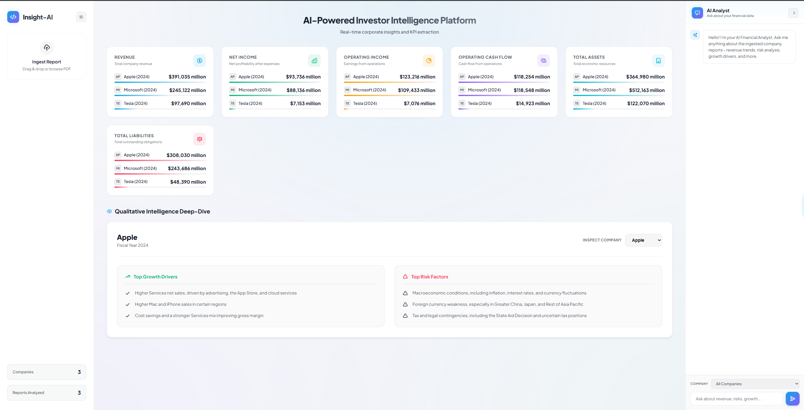
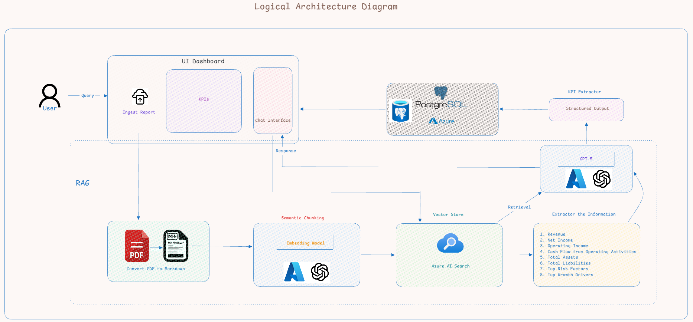
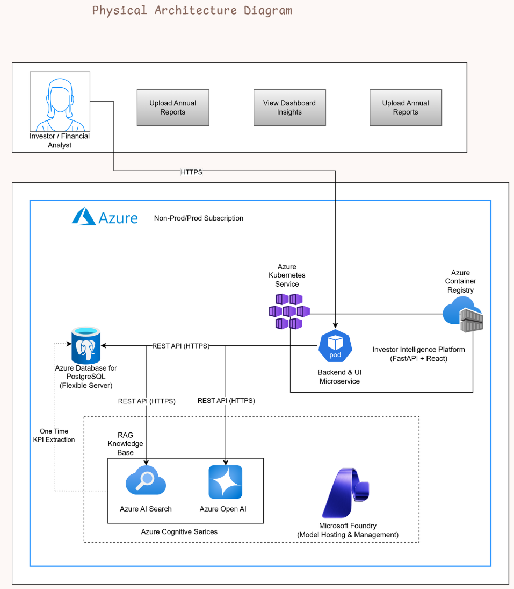

# InsightAI: AI-Powered Investor Intelligence Platform



The repo contains the Python backend for an AI-powered Investor Intelligence Platform. It ingests financial documents, extracts KPIs using Azure OpenAI models and Azure AI Search through RAG, stores them in PostgreSQL database, and ships to Azure Kubernetes Service through an automated CI/CD pipeline.

For the phase-by-phase build history of this project, see [`project_journey.md`](project_journey.md).

## Prerequisites

* Python 3.12+
* UV Package Manager

## Setup

### 1. Install UV

#### Windows

```bash
powershell -ExecutionPolicy ByPass -c "irm https://astral.sh/uv/install.ps1 | iex"
```

#### macOS/Linux

```bash
curl -LsSf https://astral.sh/uv/install.sh | sh
```

Verify installation:

```bash
uv --version
```

---

### 2. Create Virtual Environment

```bash
uv venv
```

---

### 3. Activate Virtual Environment

#### Windows

```bash
.venv\Scripts\activate
```

#### macOS/Linux

```bash
source .venv/bin/activate
```

---

### 4. Install Dependencies

```bash
uv pip install -r requirements.txt
```

---

### 5. Configure Environment Variables

Create a `.env` file and configure all required environment variables before running the application.

---

### 6. Run the Application

```bash
python app.py
```

---

## Project Features

* Annual Report Upload & Processing
* KPI Extraction using Azure OpenAI
* Azure AI Search Integration
* Semantic Search & Retrieval
* RAG-based Chatbot
* PostgreSQL KPI Storage
* Investor Insights Dashboard
* Production-Grade Modular Architecture

---

## Technology Stack

### Backend

* FastAPI
* Python 3.12

### AI Services

* Azure OpenAI (Chat Model)
* Azure OpenAI (Embedding Model)
* Azure AI Search (Vector Store)

### Database

* Azure Database for PostgreSQL

### Deployment

* Docker
* Azure Container Registry (ACR)
* Azure Kubernetes Service (AKS)

### Package Management

* UV

---

## Azure Services Overview

The platform is built on the following Azure services:

* **Azure OpenAI (Chat)** - powers the RAG-based chatbot and financial insight generation.
* **Azure OpenAI (Embeddings)** - converts document chunks into vector embeddings for semantic search.
* **Azure AI Search** - stores embeddings and performs vector-based semantic retrieval.
* **Azure Database for PostgreSQL** - stores extracted KPI data for the dashboard.
* **Azure Container Registry (ACR)** - stores the built Docker image used by the deployment pipeline.
* **Azure Kubernetes Service (AKS)** - hosts and runs the deployed application in production.

---

## Architecture

**Logical Architecture** — how a report flows through ingestion, chunking, embedding, vector storage, and retrieval to power the dashboard and chatbot:



**Physical Architecture** — how these components map to Azure resources (AKS, ACR, Azure AI Search, Azure OpenAI, Azure Database for PostgreSQL):



---

## CI/CD Deployment

The application is containerized with Docker and deployed to AKS through a GitHub Actions pipeline.

At a high level, the pipeline:

1. Builds the Docker image and pushes it to ACR.
2. Authenticates to Azure and fetches AKS cluster credentials.
3. Creates/updates Kubernetes Secrets from GitHub repository secrets.
4. Applies the Kubernetes Deployment and Service manifests.
5. Restarts the deployment and verifies the rollout.

For the full breakdown of every field used in `k8s/deployment.yaml`, `k8s/service.yaml`, and `.github/workflows/deploy.yml`, see [`CICD_Deployment_Guide.md`](CICD_Deployment_Guide.md).

---

## Notes

* Ensure all Azure resources are configured before running the application.
* Verify that PostgreSQL firewall rules allow access from the application.
* Store secrets in environment variables and never commit `.env` files to source control.
* For production deployments, use Azure Key Vault or Kubernetes Secrets for secret management.
