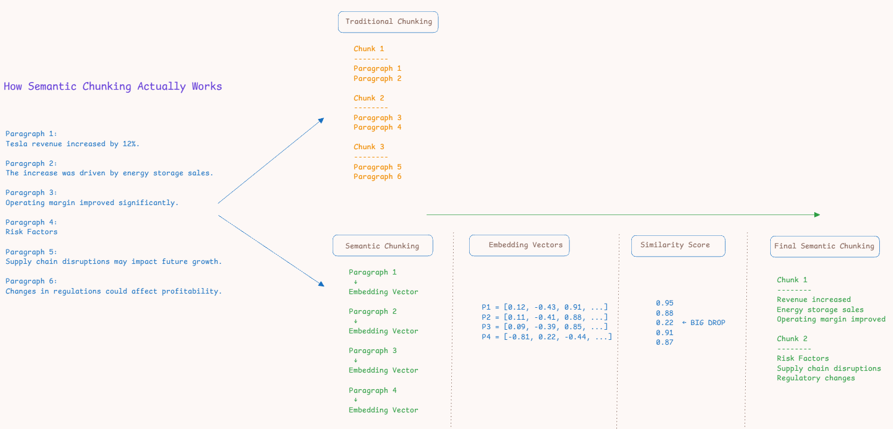
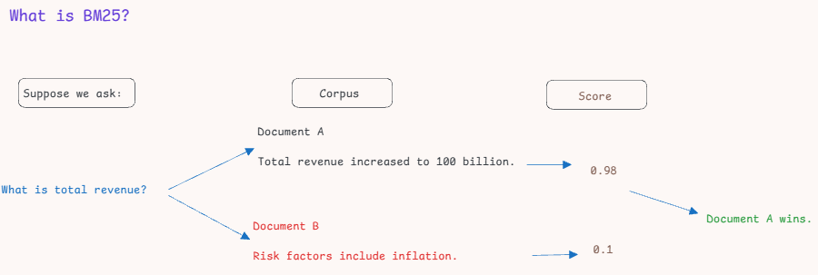
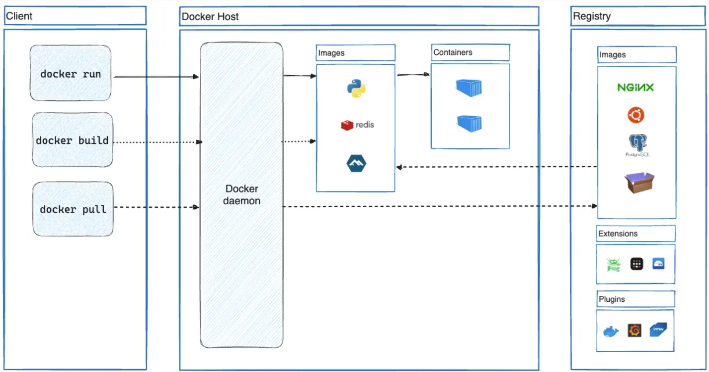
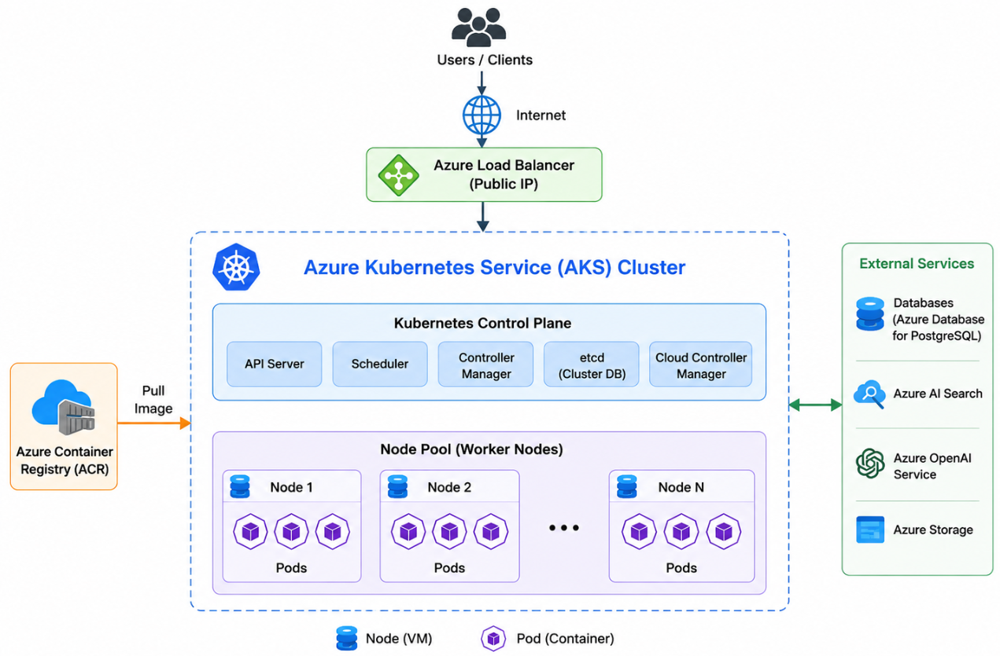
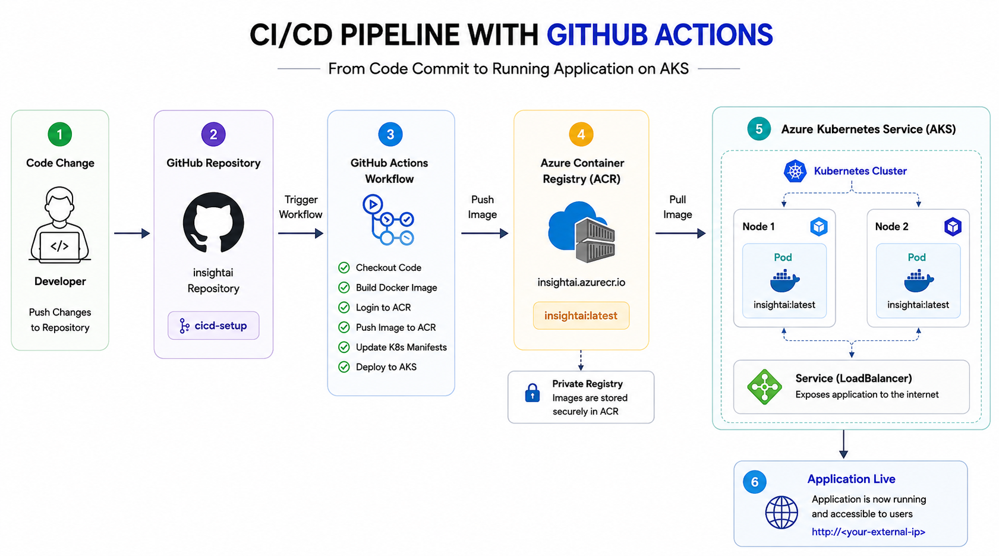

# InsightAI: AI-Powered Investor Intelligence Platform

> End-to-end Financial Document Intelligence Platform using Azure OpenAI, Azure AI Search, Azure Database for PostgreSQL, FastAPI and AKS.

---

## Project Goal

Investors and analysts spend significant manual effort digging through hundreds of pages of annual reports to identify revenue performance, profitability, risks, and growth opportunities. This platform exists to automate that analysis, turning lengthy financial documents into structured dashboards and conversational insights so decisions can be made faster.

Build an enterprise-grade application capable of:

* Processing financial reports
* Extracting key financial insights
* Generating analytics dashboards
* Supporting RAG-based financial research
* Deploying to Azure Kubernetes Service (AKS)

---

## Phase 1: Project Planning

Activities:

* Selected Financial Statement Analysis as the use case.
* Chose annual reports as the primary data source.
* Selected Tesla, Apple and Microsoft annual reports.
* Defined RAG + Dashboard architecture approach.
* Decided to build an Investor Intelligence Platform instead of a chatbot.

---

## Phase 2: Dataset Preparation

Activities:

* Downloaded annual reports.
* Stored PDF files under:

```text
data/raw_pdfs/
```

* Selected publicly available investor reports.

---

## Phase 3: PDF to Markdown Conversion

Module:

```text
ingestion/pdf_to_markdown.py
```

Objective:

Convert annual report PDFs into markdown format suitable for downstream LLM processing.

Library:

```text
PyMuPDF4LLM
```

Output:

```text
data/markdown/
```

---

## Phase 4: Semantic Chunking

Module:

```text
ingestion/semantic_chunker.py
```

Objective:

Generate semantically meaningful chunks from markdown documents.

Library:

```text
LangChain SemanticChunker
```

Embedding Model:

```text
Azure OpenAI Embeddings (text-embedding-ada-002)
```

Output:

```text
Document Chunks
```

How It Works:



---

## Phase 5: Azure OpenAI Integration

Module:

```text
llm/azure_openai.py
```

Objective:

Centralize Azure OpenAI configuration and model initialization.

Deliverables:

* Embedding Model Configuration
* GPT Model Configuration
* Azure OpenAI Client

Note: Any GPT-based chat model deployed on Azure OpenAI can be used here for compatibility.

---

## Phase 6: Azure AI Search Integration

Module:

```text
vectorstore/azure_ai_search.py
```

Objective:

Store document chunks and embeddings for retrieval.

Deliverables:

* Create Index
* Upload Chunks
* Vector Search
* Metadata Filtering

Retrieval currently uses Azure AI Search's default keyword search (`search_text`), which ranks results using the BM25 algorithm rather than vector similarity.



---

## Phase 7: KPI Extraction

Module:

```text
rag/kpi_extractor_rag.py
```

Objective:

Extract financial KPIs using Retrieval-Augmented Generation (RAG).

KPIs:

* Revenue
* Net Income
* Operating Income
* Operating Cash Flow
* Total Assets
* Total Liabilities

Output:

```text
Structured Financial Metrics
```

Sample Output:

```python
sample_metrics = {
    "Revenue": "$391,035",
    "Net Income": "$93,736",
    "Operating Income": "$123,216",
    "Cash Flow from Operating Activities": "$118,254",
    "Total Assets": "$364,980",
    "Total Liabilities": "$308,030",
    "Top Risk Factors": [
        'Macroeconomic conditions including inflation, interest rates, and currency fluctuations could materially impact results.',
        'High competition with aggressive pricing, short product life cycles, and rapid technological changes.',
        'Dependence on single or limited sources for certain components, with potential supply shortages.',
        'Exposure to foreign exchange rate fluctuations impacting sales and margins.',
        'Legal and regulatory challenges, including significant tax disputes such as the State Aid Decision.'
    ],
    "Top Growth Drivers": [
        'Increased Services revenue from advertising, App Store, and cloud services.',
        'Higher Mac sales driven by increased laptop demand.',
        'Continued strong iPhone sales performance.'
    ]
}
```

---

## Phase 8: Azure Database for PostgreSQL Integration

Module:

```text
database/postgres_sql.py
```

Objective:

Store extracted KPI data for dashboard consumption.

Output:

```text
Financial Metrics Database
```

---

## Phase 9: FastAPI Backend

Objective:

Expose APIs for application functionality.

Endpoints:

* Upload Documents (`POST /api/upload`)
* Dashboard Data (`GET /api/metrics`)
* AI Research (`POST /api/chat`)

---

## Phase 10: Dashboard Frontend

Built as a server-rendered dashboard using Jinja2 templates within FastAPI, rather than a separate frontend framework.

Module:

```text
templates/dashboard.html
static/style.css
```

Display:

* Revenue
* Net Income
* Operating Income
* Operating Cash Flow
* Total Assets
* Total Liabilities
* Qualitative Insights (Growth Drivers, Risk Factors)
* AI Research Chat Panel

---

## Phase 11: RAG Research Pipeline

Module:

```text
rag/kpi_extractor_rag.py
routes/chat.py
```

Objective:

Retrieve relevant chunks and generate grounded financial insights.

Components:

* Retriever (`vectorstore/azure_ai_search.py`)
* Prompt Builder
* GPT Response Generator (`llm/azure_openai.py`)

---

## Phase 12: Containerization

Deliverables:

* Single Docker Image (FastAPI backend + server-rendered dashboard)

Docker Architecture:



---

## Phase 13: AKS Deployment

Deliverables:

* Kubernetes Deployment
* Services
* Production Validation

AKS Architecture:



---

## Phase 14: CI/CD Automation

Objective:

Automate building, pushing, and deploying the application to AKS on every push, removing the need for manual Docker and `kubectl` commands.

Deliverables:

* GitHub Actions Workflow (`.github/workflows/deploy.yml`)
* Automated Docker Build & Push to ACR
* Automated AKS Credential Retrieval
* Automated Kubernetes Secrets Creation
* Automated Deployment Rollout & Verification

CI/CD Pipeline:



For a detailed breakdown of the pipeline and Kubernetes manifests, see [`CICD_Deployment_Guide.md`](CICD_Deployment_Guide.md).

---

## Final Deliverable

AI-Powered Investor Intelligence Platform

Capabilities:

* Financial Report Processing
* Semantic Search
* KPI Extraction
* Dashboard Analytics
* RAG-Based Financial Research
* Cloud-Native Deployment

---

## Improvements / Future Plans

These are some improvements that I plan to work towards in the future. Currently, the goal of this project wasn't a perfect enterprise platform - it was understanding the complete lifecycle. With these fundamentals, implementing enterprise-grade capabilities becomes significantly easier.

1. **Authentication & Access Control** — Currently, the dashboard and chat are open with no login. Add Microsoft Entra ID-based authentication with MFA, and use RBAC so only specific roles (e.g., managers) can ingest reports while others only view the dashboard.

2. **Secret & Identity Management** — Secrets are currently injected via GitHub Secrets into a Kubernetes Secret, and ACR uses static admin credentials. Move to Azure Key Vault for centralized secret storage, and adopt Managed Identity for AKS-to-ACR authentication instead of key-based credentials.

3. **AI Guardrails** — The chatbot currently has no scope restriction. Add Responsible AI guardrails so it stays limited to financial questions grounded in the ingested reports.

4. **Availability & Scaling** — The deployment currently runs a single replica with no autoscaling (for cost minimization). Increase replica count, enable Horizontal Pod Autoscaling and AKS cluster autoscaling to handle variable traffic.

5. **Monitoring & Observability** — There is no centralized logging or monitoring today. Add Azure Monitor, Application Insights, and Log Analytics (with Power BI) for centralized logging and visibility into application health.

6. **Backup & Disaster Recovery** — There is no automated database backup strategy currently. Add scheduled Azure Database for PostgreSQL backups to protect against data loss and support recovery.
